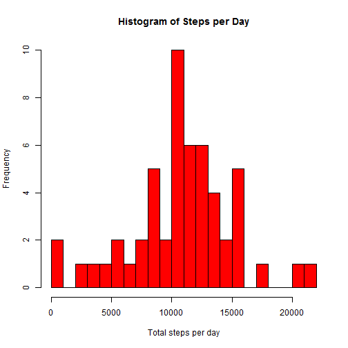

# Reproducible Research: Peer Assessment 1

## Setting ECHO=TRUE Globally


```r
opts_chunk$set(echo = TRUE)
```


## Loading and preprocessing the data


```r
getwd()
```

```
## [1] "D:/Google Drive/_RProjects/PA1"
```


```r
data <- read.csv("activity.csv")
```


### Make a Histogram of the total number of steps taken each day


```r
sumOfSteps <- aggregate(steps ~ date, data, sum)
hist(sumOfSteps$steps, breaks = 25, col = "red", xlab = "Total steps per day", 
    main = "Histogram of Steps per Day")
```

 


### What is the mean and median of the total number of steps taken per day?


```r
mean(sumOfSteps$steps)
```

```
## [1] 10766
```

```r
median(sumOfSteps$steps)
```

```
## [1] 10765
```


## What is the average daily activity pattern?

### Time series plot of 5-minute interval vs. average steps


```r
steps5Min <- aggregate(steps ~ interval, data, mean)
plot(steps5Min$interval, steps5Min$steps, type = "l", main = "Average Daily Activity", 
    xlab = "5 minutes intervals", ylab = "Average steps per day")
```

 


### Which 5 minute interval on average contains the maximum number of steps?


```r
max(steps5Min$steps)
```

```
## [1] 206.2
```

```r
steps5Min[steps5Min$steps > 206, ]
```

```
##     interval steps
## 104      835 206.2
```


## Imputing missing values

### Calculate and report total number of missing values in the dataset


```r
sum(complete.cases(data))  ## cases without NA in any column
```

```
## [1] 15264
```

```r
sum(!is.na(data$steps))  ## rows without missing values in column steps
```

```
## [1] 15264
```

```r
sum(is.na(data$steps))  ## rows with missing values in column steps
```

```
## [1] 2304
```

```r
sum(is.na(data$date))  ## rows with missing values in column date
```

```
## [1] 0
```

```r
sum(is.na(data$interval))  ## rows with missing values in column interval
```

```
## [1] 0
```

### There are 2304 cases with missing values, all of them in column steps.

### Filling Missing Values with imputation


```r

# library(Amelia) ## loads program for imputation AmeliaView() ## loads GUI
# to do the imputation

## calculates means of steps in the whole file to be used as maximum value in
## the imputation
meanOfSteps <- mean(data$steps, na.rm = TRUE)  ## the mean of Steps is 37.38

## loading new dataset with imputed Missing Values
data2 <- read.csv("activity-imp1.csv")
```

### Make Histogram of the total step taken in the day and calculate mean and median


```r
sumOfSteps2 <- aggregate(steps ~ date, data2, sum)
hist(sumOfSteps2$steps, breaks = 25, col = "blue", xlab = "Total steps per day", 
    main = "New Histogram of Steps per Day")
```

 


### What is the mean and median of the total number of steps taken per day?


```r
mean(sumOfSteps2$steps)
```

```
## [1] 10072
```

```r
median(sumOfSteps2$steps)
```

```
## [1] 10395
```

### Imputing the Missing data did not modify the histogram, mean and median significantly

## Are there differences in activity patterns between weekdays and weekends?

### Adding the column days and converting dates to factors (weekday - weekend)


```r
library(lubridate)

data2 <- read.csv("activity-imp1.csv")

data2["days"] <- (data2date <- as.Date(data2$date))
data2["days"] <- wday(data2$days, label = TRUE)

days <- c("Sun", "Mon", "Tues", "Wed", "Thurs", "Fri", "Sat")
# days <- as.factor(days)


data2$period <- NA

data2$period[data2$days == "Sat"] <- as.character("Weekend")
data2$period[data2$days == "Sun"] <- as.character("Weekend")
data2$period[data2$days == "Mon"] <- as.character("Weekday")
data2$period[data2$days == "Tues"] <- as.character("Weekday")
data2$period[data2$days == "Wed"] <- as.character("Weekday")
data2$period[data2$days == "Thurs"] <- as.character("Weekday")
data2$period[data2$days == "Fri"] <- as.character("Weekday")

data2$period2 <- (data2$period)

```

## Make panel plot with time series of 5 minute-interval (x) and the average number of steps (y)

```r
steps5Min <- aggregate(steps ~ interval, data2, FUN = mean)

library(lattice)
xyplot(steps5Min$steps ~ steps5Min$interval | (data2$period2), type = "l", layout = c(1, 
    2), main = "Weekday/Weekend Activity", xlab = "Interval", ylab = "Number of steps")
```

 

